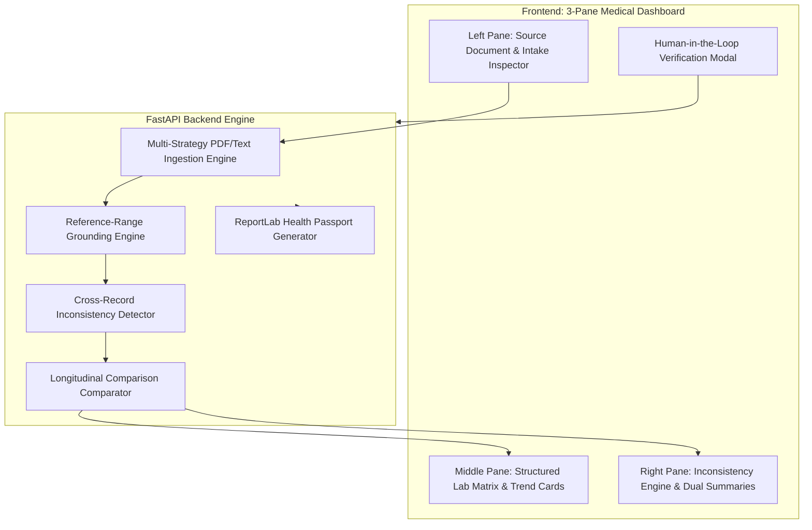

# 🏥 MedVault AI — Clinical Intelligence & Structured Medical Record Platform

[](https://fastapi.tiangolo.com)
[](https://python.org)
[](https://tailwindcss.com)
[](#reference-range-integrity)
[](LICENSE)

> **Transforming fragmented patient history, prescriptions, and laboratory reports into a structured, understandable, traceable, and reviewable patient record.**

---

## 📌 Problem Statement

Medical information is often scattered across patient history, handwritten or digital prescriptions, laboratory reports, and previous discharge summaries. This fragmentation makes it difficult for healthcare providers and patients to review data efficiently, resulting in diagnostic delays, unnoticed medication contraindications, and missed trends.

### The MedVault Solution
Unlike typical AI "chat wrappers" that dump raw text summaries, **MedVault AI** is a **high-trust clinical intelligence platform** providing structured data tables, strict source provenance, zero-hallucination reference-range awareness, cross-record conflict detection, and human verification.

---

## ✨ Key Features Aligned with Problem Statement

| Requirement | How MedVault AI Solves It |
| :--- | :--- |
| **Patient Information Intake** | Structured intake capturing age, sex, symptoms, conditions, medications, and allergies with explicit `USER_INTAKE` provenance tags. |
| **Medical Report Processing** | Multi-strategy ingestion engine for PDFs and clinical text that extracts test names, values, units, reference intervals, collection dates, and observations. |
| **Structured Medical Record** | Interactive tabular matrix categorized by clinical panel (Metabolic, Renal, Lipids, CBC, Thyroid) with live search and status filters. |
| **Reference-Range Awareness** | Source-grounded High/Low/Normal flags derived **strictly** from ranges printed on the report. If a range is omitted, it explicitly flags `⚪ NO RANGE IN SOURCE` rather than inventing standard thresholds. |
| **Source & Provenance ("Show Me Where")** | Clicking any lab test in the middle pane automatically scrolls and highlights the exact snippet in the original document viewer on the left pane. |
| **AI-Powered Dual Summaries** | Toggle between **Patient-Friendly View** (plain English, 6th-grade reading level, and actionable questions for their next visit) and **Physician Clinical SOAP View**. |
| **Inconsistency & Conflict Detection** | NLP rule engine cross-checks records to detect undisclosed allergies (e.g., Penicillin omission), contraindicated medications (e.g., NSAIDs with reduced eGFR), and drugs without stated conditions. |
| **Longitudinal Trend Tracking** | Automatically compares current vs. historical reports, calculating absolute delta ($\Delta$), percentage change, and trend direction ($\uparrow$ / $\downarrow$ / $\approx$). |
| **Human-in-the-Loop (HITL)** | Clinicians can inspect confidence ratings, adjust values, type reconciliation notes, and sign off, creating a permanent audit trail. |
| **PDF Health Passport Export** | One-click generation of a downloadable, formatted clinical handover PDF using ReportLab. |

---

## 🏗️ System Architecture



---

## 🚀 Quickstart Guide

### Prerequisites
- Python 3.10 or higher
- Pip

### 1. Clone the Repository
```bash
git clone https://github.com/YOUR_USERNAME/medvault-ai.git
cd medvault-ai
```

### 2. Install Dependencies
```bash
pip install -r requirements.txt
```

### 3. Start the Application
```bash
python run.py
```

### 4. Open in Browser
Navigate to:
👉 **[http://127.0.0.1:8000](http://127.0.0.1:8000)**

---

## 🧪 Automated Verification Suite

MedVault AI includes a full test suite verifying all 6 core subsystems:
```bash
python test_system.py
```

**Test Results Output:**
```text
>>> [TEST 1/6] Initializing TestClient: PASSED (/api/health returned 200 OK)
>>> [TEST 2/6] Verifying Current Patient API: PASSED (Sarah Jenkins loaded with 7 labs and 4 conflicts)
>>> [TEST 3/6] Testing Conflict Detection: PASSED (Omitted Penicillin allergy detected)
>>> [TEST 4/6] Testing Longitudinal Trends: PASSED (Glucose, HbA1c, Creatinine, eGFR deltas computed)
>>> [TEST 5/6] Testing Human-in-the-Loop Verification: PASSED (Sign-off & audit log registered)
>>> [TEST 6/6] Testing PDF Health Passport Generation: PASSED (Exported clinical PDF)

==================================================
 ALL 6 SYSTEM VERIFICATION TESTS PASSED SUCCESSFULLY!
==================================================
```

---

## 🧑‍⚕️ Pre-loaded Clinical Demo Personas

MedVault includes 3 realistic clinical personas ready for live judging demos:

1. **Sarah Jenkins (52 Yrs, F) — Diabetes, Renal Function & Safety Conflicts**:
   - Demonstrates longitudinal glucose & HbA1c trends.
   - Highlights a critical undisclosed **Penicillin allergy** detected in source records.
   - Flags an NSAID (Ibuprofen) contraindication against reduced eGFR ($54 \text{ mL/min}$).
2. **Robert Vance (61 Yrs, M) — Cardiovascular & Lipid Tracking**:
   - Demonstrates positive medication response with LDL reduction ($-25.8\%$) and Total Cholesterol lowering.
   - Evaluates high-sensitivity CRP (hs-CRP) inflammatory marker.
3. **Elena Rostova (34 Yrs, F) — Thyroid & Anemia Workup**:
   - Highlights subclinical hypothyroidism (elevated TSH, reduced Free T4).
   - Demonstrates strict reference-range handling for Ferritin and Hemoglobin.

---

## 🛡️ Safety, Security & Responsible AI

- **Non-Diagnostic Policy**: MedVault AI strictly organizes and reconciles medical information. It does **not** provide clinical diagnosis, prescribe medication, or adjust dosages.
- **No Hallucinated Ranges**: Laboratory ranges must exist within the document text; the system never substitutes assumed standard intervals.
- **Traceable Provenance**: Every extracted fact links directly back to its source snippet with page index and confidence rating.
- **Auditability**: All manual edits, uploads, and sign-offs are timestamped in the system audit log.

---

## 📄 License

This project is licensed under the [MIT License](LICENSE).
